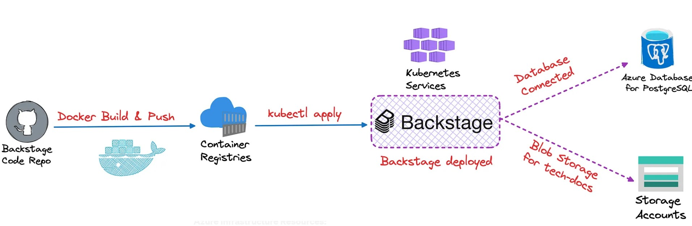

# Backstage Architecture Diagram

## Overview

Backstage is an open-source platform for building developer portals, created by Spotify. It provides a centralized place where developers can manage, discover, and interact with various tools, services, and infrastructure components within an organization. Backstage focuses on making the lives of developers easier by providing a single interface to manage everything from APIs to documentation and software catalogs.

---

## High-Level Architecture

### Key Features:
1. **Software Catalog:**
Backstage provides a centralized catalog of all software, services, and components. It helps teams maintain a clear overview of the services they own, track ownership, and manage their entire infrastructure.

2. **TechDocs:**
It includes built-in support for technical documentation generation. Using tools like MkDocs and Markdown, developers can generate and publish documentation for services, APIs, and other software components within the portal, making it easier to find and maintain documentation.

3. **Plugins Architecture:**
Backstage is highly extensible and supports a plugin-based architecture. This allows organizations to integrate Backstage with their internal and third-party tools such as CI/CD pipelines, monitoring systems, cloud platforms, version control, and more.

4. **API Management:**
Backstage can help manage APIs with features like automatic API discovery, cataloging, and documentation. It simplifies the process of creating, deploying, and managing APIs across teams.

5. **Golden Path Templates:**
Backstage includes "Golden Path" templates, which are predefined templates for building services, infrastructure, or other components that align with best practices. It standardizes and accelerates new service creation.

6. **Self-Service and Developer Autonomy:**
By integrating multiple developer tools into a single interface, Backstage enables developers to operate more autonomously. They can onboard, monitor, and manage their projects and services without needing constant intervention from operations or platform teams.

7. **Scalable Microservice Architecture:**
With Backstage, microservice architecture management is made easier, with clear ownership, health checks, and documentation for every service. This improves the transparency and health of services across large organizations.

---

## Benefits of Backstage

1. **Increased Productivity:**
Backstage eliminates the need to switch between multiple tools, providing everything in one place.
2. **Standardization:**
By offering a single platform with best-practice templates, it ensures standardization across teams.
3. **Improved Developer Experience:**
Developers can spend more time coding and less time dealing with tools, settings, and documentation management.
4. **Visibility and Ownership:**
It promotes transparency in who owns what, which services are running, and their status.
5. **Extensibility:**
With plugins, Backstage can be extended to integrate with virtually any tool or platform.
---

## Conclusion

Backstage has evolved into a key tool for organizations adopting microservices and DevOps practices, aiming to simplify developer workflows, increase productivity, and ensure consistency across the development lifecycle.

For further details on specific components or integration options, refer to the respective sections of this documentation.
